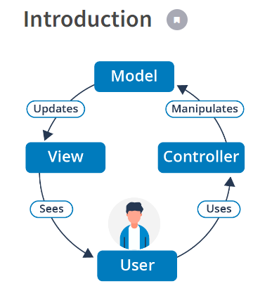

#### Basic principles of object-oriented design
[Basic principles of object-oriented design](https://university.epam.com/myLearning/path?rootId=13419331&moduleId=13419403)

5.
    - MVC
___

Sources:
- [What is Java MVC Pattern? Why use Java MVC Pattern?](https://www.youtube.com/watch?v=yjhMBipAx_A)
- [MVC Design Pattern](https://www.geeksforgeeks.org/mvc-design-pattern/)
- [MVC Architecture in Java](https://www.javatpoint.com/mvc-architecture-in-java)
- [How to Build a Simple MVC App From Scratch in JavaScript](https://www.taniarascia.com/javascript-mvc-todo-app/)
- 
___
- [JSP_model_2_architecture](https://en.wikipedia.org/wiki/JSP_model_2_architecture)
- [observer](https://refactoring.guru/design-patterns/observer)
- [facade](https://refactoring.guru/design-patterns/facade)
- 

---
