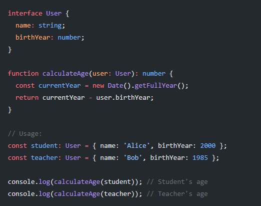

here we have a semantic error: Teacher is a user - this misleads to creating 2 functions

which can lead to the following solution complying 2 functions

create a single function that calculates the age of a user, regardless of their role

